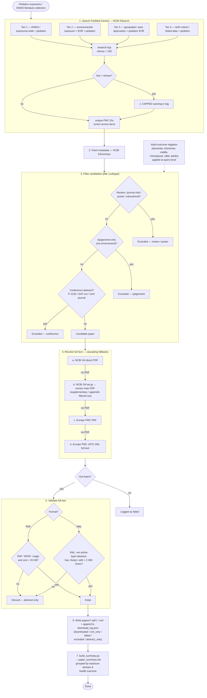

# Pediatric Exposome / EWAS Literature Collection

A reproducible pipeline that searches PubMed Central for **pediatric / childhood
environmental-exposure (exposome / EWAS) studies** using EHR, administrative /
claims, or linked cohort data, then downloads the open-access full text and
produces a structured inventory for systematic-review work.

> **Current collection: 116 full-text papers** (99 PDFs + 17 JATS-XML),
> 1990–2026. See [`paper_summary.md`](./paper_summary.md) for the inventory.

## Quick start

```bash
make setup      # create .venv and install all deps (requests, openai, pypdf, pydantic)
make download   # run the pediatric PMC fetcher (incremental — skips what's on disk)
make summary    # regenerate paper_summary.md + print a compact inventory
make fresh      # clean + re-download from scratch
make clean      # remove downloaded PDFs/XML + download log + summaries
```

`papers/` (PDFs, XML, `download_log.json`) is gitignored — only the scripts,
Makefile, and `paper_summary.md` are tracked.

## Manuscript summarization (Gemma 4 12B → Pydantic JSON)

Each downloaded manuscript is summarized into a structured **checklist** by
**Gemma 4 12B** via an external OpenAI-compatible endpoint, and validated with
a Pydantic schema. The checklist captures the existence of EHR usage, a
summary, key findings, captured EHR features, pathologies/diseases, and
extended review fields.

```bash
cp .env.example .env        # fill in GEMMA_API_KEY (never committed)
make summarize              # summarize all manuscripts -> per-paper + combined JSON
make summarize-paper PMC=PMC7145790   # summarize one paper
make test                   # unit tests (no live API calls)
```

**Output:**

- `papers/summaries/<pmcid>.json` — one checklist per paper
- `papers/manuscript_summaries.json` — combined file with all checklists

**Checklist schema** (`summarizer/schema.py`, `ManuscriptChecklist`):

| Field | Type | Description |
|-------|------|-------------|
| `pmcid` / `title` / `year` | str | identity (from download log) |
| `ehr_used` | bool | does the study use EHR/EMR/claims/admin data? |
| `ehr_evidence` | str | sentence(s) justifying `ehr_used` |
| `summary` | str | 2-4 sentence summary |
| `key_findings` | list[str] | main results |
| `captured_features` | list[str] | EHR features/variables captured |
| `pathologies_diseases` | list[str] | disease(s)/outcome(s) |
| `study_design` / `data_source_type` / `population` / `exposure_domain` | str | review fields |
| `limitations` | list[str] | stated limitations |
| `confidence` | high\|medium\|low\|unclear | fit for a pediatric EHR/exposome review |
| `source_format` / `model` | str | provenance |

The model is reasoning-heavy and wraps JSON in chain-of-thought, so the client
uses a strict fixed-key prompt, robust fenced/balanced-JSON extraction with
light repair for truncated responses, lenient field validators (e.g. `"Yes"` →
`true`), and a retry-with-nudge loop on validation failure.

## Data-collection process

The pipeline is implemented in [`fetch_pmc_papers.py`](./fetch_pmc_papers.py)
and runs in seven stages: a pediatric-constrained PMC search → metadata fetch
→ candidate filtering → a cascading full-text resolver → full-text
validation → on-disk output + audit log → summary regeneration.



## Search strategy

Every query ANDs in a pediatric population constraint
(`pediatric` / `paediatric` / `child` / `children` / `childhood` / `infant` /
`newborn` / `neonatal` / `adolescent` / `youth` / `early life` / `pediatrics`,
all `[Title/Abstract]`) so every retained hit is pediatric by construction.
Adult-only outcomes are negated at the query level to stop adult studies
leaking in via incidental "child" mentions.

| Tier | Rationale |
|------|-----------|
| 1 | Explicit `environment-wide` / `exposome-wide` association in pediatric populations |
| 2 | Environmental exposure × EHR/claims/admin data × pediatric (all in abstract) |
| 3 | Geospatial / area-deprivation exposure linked to pediatric EHR |
| 4 | Birth-cohort / linked-data pediatric exposome — broadened because most pediatric exposome research does not name "EHR" in the abstract |

## Full-text resolution & validation

Because many open-access papers have dead NCBI OA links, retrieval uses a
cascade of fallbacks: NCBI direct PDF → NCBI tar.gz extraction → Europe PMC
PDF → Europe PMC JATS XML. Every downloaded file is then **validated** as
genuine full text — PDFs by the `%PDF-` magic + minimum size, XML by checking
it is not an `article-type="abstract"` record and that it has a real `<body>`
— so abstract-only conference / supplement records that slipped past the title
filter are discarded rather than counted as papers.

## Output

| Path | Contents |
|------|----------|
| `papers/*.pdf` | Downloaded full-text PDFs |
| `papers/*.xml` | JATS-XML full text (where no PDF was resolvable) |
| `papers/download_log.json` | Audit log: `downloaded`, `excluded`, `failed`, `abstract_only`, `xml_only`, `papers` |
| `paper_summary.md` | Human-readable inventory grouped by exposure domain and health outcome |

## Files

| File | Purpose |
|------|---------|
| `fetch_pmc_papers.py` | Search + filter + download pipeline |
| `build_summary.py` | Regenerates `paper_summary.md` from the download log |
| `summarizer/` | Manuscript summarization pipeline (Pydantic schema + Gemma client + extractor + runner) |
| `Makefile` | `setup` / `download` / `clean` / `fresh` / `summary` / `summarize` / `test` targets |
| `paper_summary.md` | Generated inventory (do not hand-edit) |
