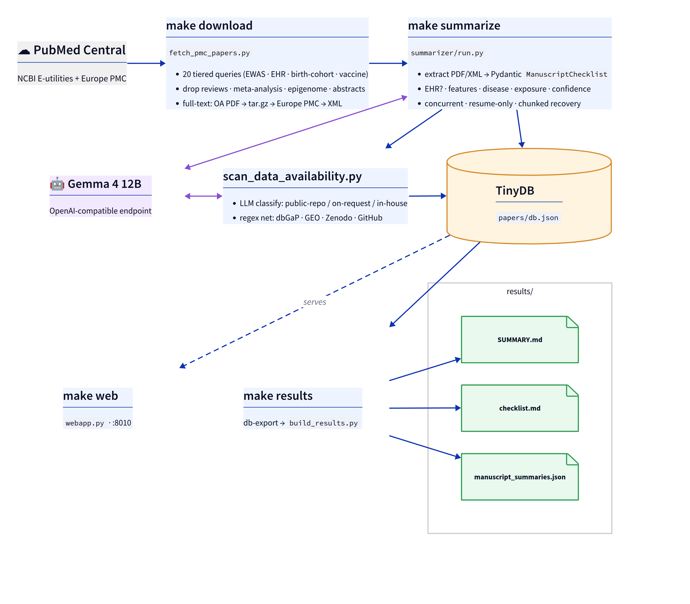

# Pediatric Exposome / EWAS Literature Collection

A reproducible pipeline that searches PubMed Central for **pediatric / childhood
environmental-exposure (exposome / EWAS) studies** and **pediatric
vaccine/immunization-exposure studies**, using EHR, administrative / claims, or
linked cohort data, downloads the open-access full text, summarizes each
manuscript with **Gemma 4 12B**, and captures **data-availability** (accession
numbers / repository links) for systematic-review work.

> **Current collection: 166 full-text papers**, 1990–2026, **20 EHR-based**.
> Browse the live inventory at
> **[hyunhwan-bcm.github.io/exposome-ehr-review](https://hyunhwan-bcm.github.io/exposome-ehr-review/)**
> or see [`paper_summary.md`](./paper_summary.md).

## Quick start

```bash
make setup      # create .venv + install deps (requests, openai, pypdf, pydantic, tinydb, dagster)
make download   # pediatric PMC fetcher (incremental — skips what's on disk)
make summarize  # Gemma 4 12B -> per-paper + combined JSON (concurrent; --workers via SUMMARIZE_ARGS)
make results    # export readable results/ (SUMMARY.md, checklist.md, combined JSON)
make site       # regenerate the static GitHub Pages site in docs/
make test       # unit tests (no live API calls)
```

`papers/` (PDFs, XML, `download_log.json`, TinyDB `db.json`) is tracked in
Git — large/binary files (`*.pdf`, `*.xml`, `db.json`) go through **Git LFS**
(see `.gitattributes`); run `git lfs install` once after cloning.

## Pipeline overview

<table>
<tr><td align="center">

</td></tr>
<tr><td>

**Figure 1. End-to-end literature pipeline.** From **PubMed Central**, `make download` fetches and filters open-access full text (20 tiered queries; reviews / meta-analyses / epigenome / conference abstracts dropped; full-text fallback OA PDF → tar.gz → Europe PMC → JATS XML). `make summarize` extracts each manuscript into a Pydantic `ManuscriptChecklist` via **Gemma 4 12B**, and `scan_data_availability.py` classifies data availability (public-repo / on-request / in-house / …) with a regex safety-net for accession links (dbGaP · GEO · Zenodo · GitHub). Both LLM stages round-trip with Gemma and write to the **TinyDB** store (`papers/db.json`), the single source of truth. `make results` exports it to `results/` (`SUMMARY.md`, `checklist.md`, `manuscript_summaries.json`) and `make web` serves it as a browsable app on `:8010`.

</td></tr>
</table>

> Diagram source: [`docs/pipeline.d2`](./docs/pipeline.d2) — re-render with
> [d2](https://d2lang.com) (`d2 --layout elk docs/pipeline.d2 docs/pipeline.svg`).
> The PNG is embedded because GitHub strips an SVG's `foreignObject` text labels.

## Documentation

| Guide | Contents |
|-------|----------|
| [docs/data-collection.md](./docs/data-collection.md) | Search strategy (Tier 1–5), the seven-stage fetch process, full-text resolution & validation |
| [docs/summarization.md](./docs/summarization.md) | Gemma 4 12B summarization, the `ManuscriptChecklist` schema, and the data-availability scan |
| [docs/orchestration.md](./docs/orchestration.md) | TinyDB store, Dagster asset graph, GitHub Actions, and the full list of generated outputs |

## Static site (GitHub Pages)

A self-contained, Tailwind-styled site in [`docs/`](./docs/) presents the
headline stats and a **searchable / filterable / sortable inventory** of every
summarized paper (data embedded inline, no runtime fetch), served at
**[hyunhwan-bcm.github.io/exposome-ehr-review](https://hyunhwan-bcm.github.io/exposome-ehr-review/)**.
`make site` regenerates `docs/index.html` + the minified `docs/tailwind.css`;
both are committed so Pages needs no build step. Pages source: **`main` / `/docs`**.

## Files

| File | Purpose |
|------|---------|
| `fetch_pmc_papers.py` | Search + filter + download pipeline |
| `build_summary.py` | Regenerates `paper_summary.md` from the download log |
| `build_results.py` | Exports readable `results/` from the combined JSON |
| `build_site.py` | Generates the static GitHub Pages site (`docs/index.html`) from the combined JSON |
| `summarizer/` | Manuscript summarization (Pydantic schema + Gemma client + extractor + runner) |
| `scan_data_availability.py` | Focused LLM + regex scan for data-availability / accession links |
| `database.py` / `db.py` | TinyDB store + CRUD CLI |
| `pipeline.py` / `pipeline_ops.py` | Dagster asset orchestration (fetch → summarize → combined → results) |
| `Makefile` | `setup` / `download` / `summarize` / `results` / `site` / `db-*` / `dagster` / `materialize` / `test` targets |
| `paper_summary.md` | Generated inventory (do not hand-edit) |
